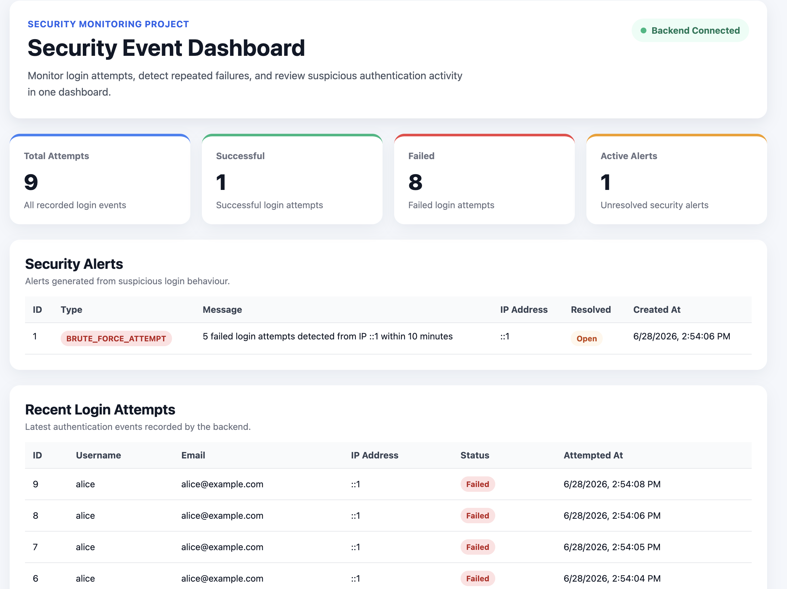

# Security Event Dashboard

A full-stack security monitoring dashboard that records login attempts, detects repeated failed logins, and displays suspicious authentication activity.

## Overview

Security Event Dashboard is a full-stack web application built to demonstrate basic security monitoring concepts.

It records successful and failed login attempts, stores them in a PostgreSQL database, and generates an alert when repeated failed login attempts are detected from the same IP address.

This project connects concepts from database design, backend API development, authentication, and security event monitoring.

## Features

- User registration with password hashing
- User login with success/failure tracking
- Login attempt logging
- Failed login detection by IP address
- Brute-force style alert generation
- Dashboard summary cards
- Security alerts table
- Recent login attempts table
- React frontend connected to Express backend APIs
- Security alert resolution workflow

## Tech Stack

### Frontend

- React
- Vite
- Axios

### Backend

- Node.js
- Express
- PostgreSQL
- bcrypt
- dotenv
- cors

## Project Structure

```text
security-event-dashboard/
├── backend/
│   ├── src/
│   │   ├── controllers/
│   │   ├── db/
│   │   ├── routes/
│   │   ├── services/
│   │   └── server.js
│   ├── schema.sql
│   └── package.json
│
├── frontend/
│   ├── src/
│   │   ├── components/
│   │   ├── pages/
│   │   ├── App.jsx
│   │   └── main.jsx
│   └── package.json
│
├── screenshots/
│   └── dashboard.png
│
└── README.md
```

## Database Design

The project uses three main tables.

### users

Stores registered user accounts.

```text
id
username
email
password_hash
role
created_at
```

### login_attempts

Stores every login attempt, including failed attempts for existing and non-existing users.

```text
id
user_id
username_attempted
ip_address
success
attempted_at
```

### security_alerts

Stores security alerts generated from suspicious login behaviour.

```text
id
alert_type
message
ip_address
created_at
resolved
```

## API Endpoints

### Auth

```text
POST /api/auth/register
POST /api/auth/login
```

### Dashboard Data

```text
GET /api/dashboard/summary
GET /api/login-attempts
GET /api/security-alerts
```

## Detection Logic

The current detection rule is:

```text
If the same IP address has 5 or more failed login attempts within 10 minutes,
create a BRUTE_FORCE_ATTEMPT alert.
```

To avoid duplicate alerts, the backend checks whether an unresolved alert from the same IP address already exists within the recent time window.

## Screenshots



## How to Run Locally

### 1. Clone the repository

```bash
git clone https://github.com/minseong-sim/security-event-dashboard.git
cd security-event-dashboard
```

### 2. Set up the backend

```bash
cd backend
npm install
```

Create a `.env` file inside `backend/`.

```env
PORT=5001
DB_HOST=localhost
DB_PORT=5432
DB_NAME=security_dashboard
DB_USER=your_postgres_user
DB_PASSWORD=your_postgres_password
```

Create the database and apply the schema.

```bash
createdb security_dashboard
psql security_dashboard -f schema.sql
```

Run the backend server.

```bash
npm run dev
```

The backend should run on:

```text
http://localhost:5001
```

You can test the database connection with:

```text
http://localhost:5001/health
```

### 3. Set up the frontend

Open another terminal.

```bash
cd frontend
npm install
npm run dev
```

The frontend should run on:

```text
http://localhost:5173
```

## Example Test Flow

You can test the project by registering a user, logging in successfully, and then sending multiple failed login attempts.

### Register

```bash
curl -X POST http://localhost:5001/api/auth/register \
  -H "Content-Type: application/json" \
  -d '{"username":"alice","email":"alice@example.com","password":"password123"}'
```

### Login Successfully

```bash
curl -X POST http://localhost:5001/api/auth/login \
  -H "Content-Type: application/json" \
  -d '{"username":"alice","password":"password123"}'
```

### Trigger Failed Login Detection

Send this request 5 times.

```bash
curl -X POST http://localhost:5001/api/auth/login \
  -H "Content-Type: application/json" \
  -d '{"username":"alice","password":"wrongpassword"}'
```

After repeated failed attempts, the dashboard should show a `BRUTE_FORCE_ATTEMPT` alert.

## What I Learned

Through this project, I practised:

- Designing relational database tables for security events
- Building REST APIs with Express
- Connecting Node.js to PostgreSQL
- Hashing passwords with bcrypt
- Recording login success and failure events
- Writing simple detection logic for suspicious behaviour
- Connecting a React frontend to backend APIs
- Structuring a full-stack portfolio project

## Future Improvements

- Add JWT-based authentication
- Add protected dashboard routes
- Add admin-only access control
- Add charts for login trends
- Add filtering by username, IP address, and status
- Add Docker setup
- Deploy the frontend and backend